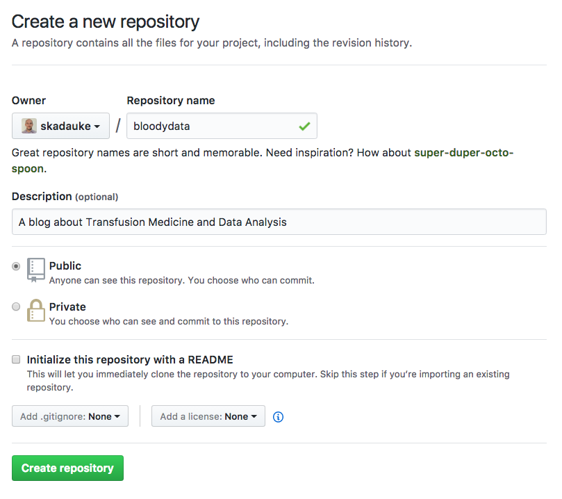

## Why blogdown?

Do you use R? Or are interested in learning about using R for your academic or business analyses? 

Do you want to create professional-looking reports showcasing your analyses? 

Want to put up your work on the web? 

Look no further! The RStudio team just dropped [**blogdown**](https://www.rstudio.com/resources/webinars/introducing-blogdown/), an R package that makes it easy to create a professional looking websites.

Here are a couple of things which make blogdown awesome:

- [**R Markdown**](http://rmarkdown.rstudio.com/) makes it easy to write technical documents that include beautiful-looking code (R, Python, Bash, SQL, you name it!), tables, formulas, and graphics. 
- [**RStudio**](https://www.rstudio.com) is the integrated development environment for R that we all know and love. And guess what - blogdown is fully integrated into RStudio!
- [**Hugo**](https://gohugo.io/) is the rendering engine that churns R Markdown into a website and allows you to preview it locally on your computer. It's [lightning fast](https://youtu.be/CdiDYZ51a2o), [themeable](http://themes.gohugo.io/), cross-platform, and easy to install.
- **LiveReload**: every time you make a change to your website's source code, blogdown will notice and rebuild the site. You will be able to see of the effects of your changes immediately[^2]. 

## Getting Started

So let's get to it! If you get lost at any point, take a look at [blogdown: Creating Websites with R Markdown](https://bookdown.org/yihui/blogdown/) written by [Yihui Xie](https://yihui.name) and [Amber Thomas](https://proquestionasker.github.io/), the definitive guide to blogdown.

I assume that you already have installed [R](https://www.r-project.org/) and [RStudio](https://www.rstudio.com/). 

Next install blogdown and Hugo[^1]:

```{r eval=FALSE}
install.packages("devtools")
devtools::install_github("rstudio/blogdown")
blogdown::install_hugo()
```

Within RStudio create a new Project under a new directory by selecting from the menu `File -> New Project`. Select `New Directory` and `Empty Project` and come up with a meaningful and creative name for your new blog, for example ... `blog`. 

Then call the following function from the R console:

```{r eval=FALSE}
blogdown::new_site()
```

This accomplishes the following:

1. Creates a new site with the default `Lithium` theme. (You can always change it later.)
2. Adds some sample posts. (Markdown source files will go into the `contents/` folder.)
3. Renders the site using Hugo. (This will go into the `public/` folder.)
4. Starts a local webserver to serve the site.
5. Loads the frontpage in the RStudio Viewer.

You can now browse the site in the viewer window or by pointing your browser to <http://127.0.0.1:4321/>.

If you want to restart the Hugo server, either call `blogdown::serve_site()` in the consolve or select `Addins -> Serve Site` in RStudio.

## Configure blogdown

There are some global settings you will want to change. 

Go to `Tools -> Project Options -> Build Tools` and unselect `"Preview site after building"` and `"Re-knit current preview when supporting files change."`. These options duplicate some of the LiveReload functionality.

You may have noticed that the hugo server locks out the R console when it's running. To change this behavior create a `.Rprofile` file which R runs 

```{r eval=FALSE}
file.edit(".Rprofile")
```

The following code tells blogdown to run the hugo server in the background. In addition, it sets the default author name (you would substitute `<Your Name>` with your name) and sets the default new post format to R Markdown (instead of Markdown), which I recommend[^3].

```{r eval = FALSE}
options(servr.daemon = TRUE,
        blogdown.author = "<Your Name>",
        blogdown.rmd = TRUE)
```

*Make sure there is an empty line at the end of this file, otherwise it will not work!* Save and restart RStudio.

Open the `config.toml` file to set some global options for your site. Some things you might want to change are `title`, as well as your Twitter and Github URLs.

If you're having trouble coming up with a good blog name, check out [this](http://www.successfulblogging.com/how-to-come-up-with-a-blog-name/) site and also [wordoid.com](http://wordoid.com/), a word generator. 


## Write a post

The [R Markdown cheat sheet](https://www.rstudio.com/wp-content/uploads/2016/03/rmarkdown-cheatsheet-2.0.pdf) is a godsend for R Markdown newcomers. Print it out and keep it close!

Addins -> New Post: opens a dialog box that allows you to enter the metadata for the post and then creates new R markdown document, preloaded with the metadata you specified, into the editor.

You will probably want to mark your post as a **draft** at first. Draft posts will not be rendered when the site is built with `blogdown::build_site()` but will allow local previewing. Add the following line to the YAML header of the post:

```{yaml}
draft: yes
```

~ Add structure

## Add Disqus Support

Wouldn't it be great if your friends could leave comments below your posts? We'll be using [Disqus](https://disqus.com) to integrate comments on your static blog.

Head over to <https://disqus.com> and sign up for a free account. Select "I want to install Disqus on my site". 

After entering a website name and selecting a category, a new Disqus URL will be created, in my case `bloodydata.disqus.com`. The part before `.disqus.com` is your Disqus shortname.

We will stick with the Basic plan for now, which is ad-supported and free.

You next need to tell blogdown to use disqus. Edit the `config.toml` file:

```{toml}
disqusShortname = "bloodydata"
```

Note: Disqus comments won't appear in your local preview. They *will* be visible on the published site.

## Deploy and Publish!

The first step for deployment is to render the site:

```
blogdown::build_site()
```

We use [Netlify]() to deploy our blog because it's free and user-friendly. Sign up for an account. Then drag the `public/` folder onto the page, and voila - your blog is live on the web! Cool eh?!

You will probably want to change Netlify's subdomain name to something more sensible. Click `Change site name` on the `Settings` tab and enter the name you picked for your blog. Mine is <https://bloodydata.netlify.com>. 

## Continuous Deployment with GitHub and Netlify

Netlify lets you link a GitHub repository to your site. Each time you push to GitHub, Netlify builds your website using Hugo and instantaneously publishes the result on the web.

### Set up a GitHub Repo for your Blog

Head on over to [GitHub]() and create an account if you do not have one already.

Create a new repository for your blog. Make sure to name it the same as your blogdown Project. Mine is `bloodydata`. Also make sure to allow access by anyone by selecting "Public."



Next we'll want to set up version control with Git so we can plug our R project into the new repository we just created. Fortunately, RStudio [natively supports version control with Git](https://support.rstudio.com/hc/en-us/articles/200532077?version=1.0.143&mode=desktop), and we will take advantage of this.

I'm assuming (perhaps incorrectly) that you have Git installed. I am planning on writing a post shortly that details how to install Git and a few other tools that are necessary for a development environment.

Go to **Project Options** (from the Tools menu) and click **Git/SVN**. Under **Version control system** select **git**.

RStudio will ask whether you want to initiatize a new git repository for this project, which you should answer in the affirmative.

Next we'll have to connect our *local* git repository with the *remote* one that's on GitHub. Enter the following commands in Terminal:

```{bash}
git remote add origin https://github.com/skadauke/bloodydata

```

1. push site onto new github repo
2. 

To set up continuous deployment with Github and Netlify, see [this page](https://bookdown.org/yihui/blogdown/netlify.html)
TODO: add workflow to
1) put project on github
2) manage commits / pushes with RStudio
3) Continuously deploy on Netlify
4) .gitignore -> blogdown, public, .DS_Store

Sources:

1. [blogdown: Creating Websites with R Markdown](https://bookdown.org/yihui/blogdown/)
2. [Hugo - Getting Started](https://gohugo.io/overview/introduction/)
3. https://blog.hubspot.com/marketing/anatomy-perfect-blog-post and similar
4. https://www.netlify.com/docs/
5. https://proquestionasker.github.io/blog/Making_Site/
6. http://animoplex.com/
7. https://support.rstudio.com/hc/en-us/articles/200532077-Version-Control-with-Git-and-SVN
8. https://www.r-bloggers.com/rstudio-and-github/

TODO:

1. Images render in the editor but not in sites. There must be some issue with the image path that prevents Hugo from finding it.
2. Connect finished site to GitHub and document a workflow for writing posts and deploying by pushing to Github.
3. Write a blog post about setup up a development environment on a Mac: Atom, xcode, homebrew, git, MySQL (MariaDB)

[^1]: In future versions of RStudio, this process will become more streamlined, as blogdown websites will be a natively supported "Project Type."
[^2]: For some reason this didn't work for me during my initial testing but after restarting RStudio it did.
[^3]: See [here](https://bookdown.org/yihui/blogdown/output-format.html) for a discussion of using R Markdown versus Markdown.
